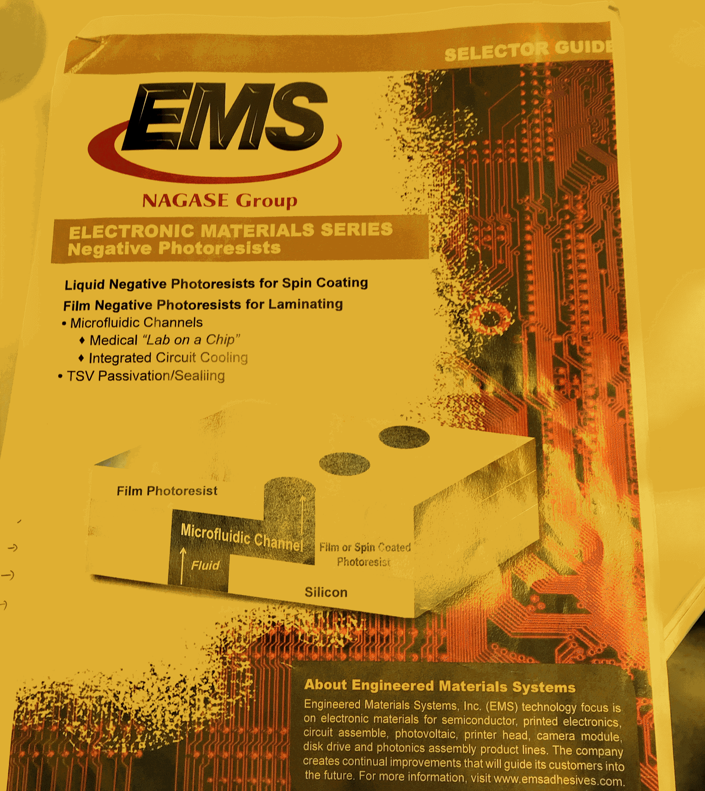
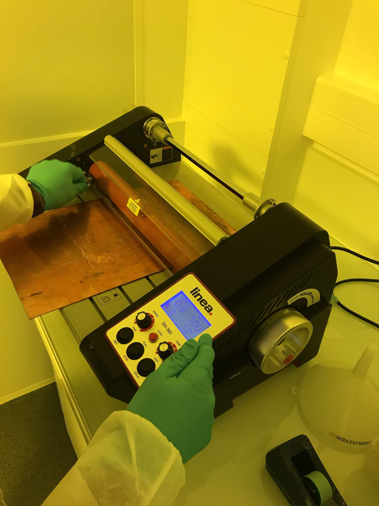
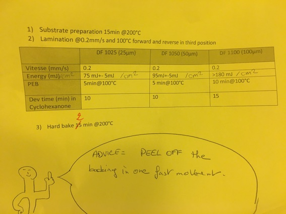
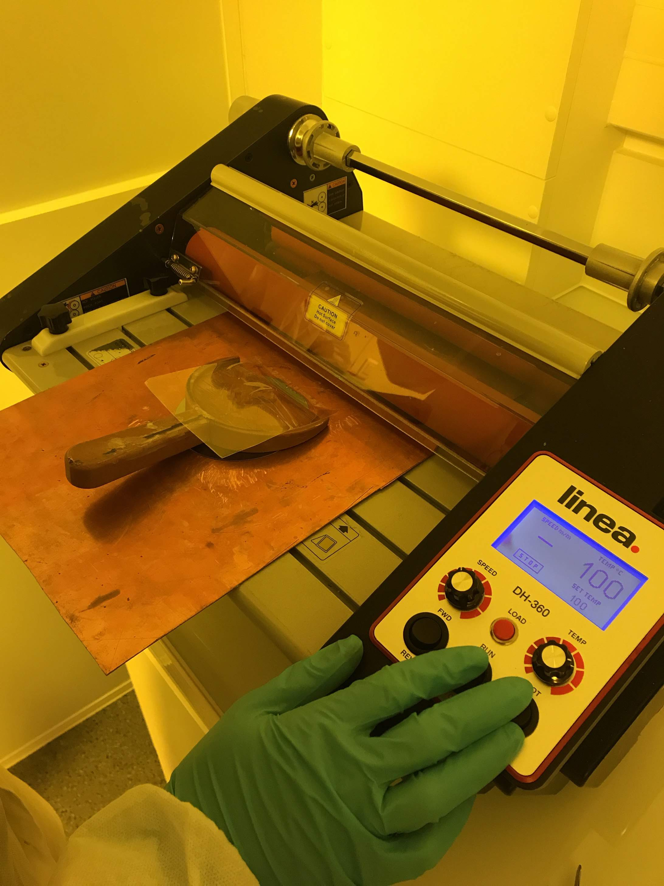

## Materials

## Preparation

Turn on the laminator and set the temperature at 100 °C and 0.2 mm/s for the speed.

Heating of the laminator takes at least 30 min so this should be done in advance

1. Turn on the hot plate near the UV Kub and set the temperature to 200°C
2. Turn on the hot plates under the draft and set the temperatures to 65°C and 100°C

## Protocol

1. Heat the silicon wafer at  200 °C for 00:10:00 on a hot plate

2. In the meantime, cut a piece of dry film at the size of the wafer.

Before cutting a new film, please check in the shelves for pieces already cut by former users

The dry film is sandwiched between 2 adhesive sheets to ease the manipulation.

As normal photoresists, dry film should not be exposed to normal light, and should always be manipulated in inactinic conditions.

After cutting, please don't thrash away reusable pieces (size > glass coverslip)

3. Place the wafer on the copper plate, at a distance of approximately 15 cm from the first laminating roll

4. Peel off the first adhesive of the dry film

Place it on the wafer in a similar manner that the one shown on the picture :

With your finger, push on the dry film to make it stick on the wafer on 1-2mm. When the film sticks to silicon, it gets a transparent aspect.

5. Check that the laminating rolls are are on the LOCK position

On the panel, put the switch on "FWD"

Put the switch on "RUN". The copper plate start to move.

Pull slowly the shovel backwards

When the wafer has been fully laminated by the second laminating roll, put the swith on "REV"

Put the switch on "STOP". The copper plate should be now immobilized

6. Peel off the second adhesive film on top of the wafer

Be careful not to pull the film perpendicularly from the wafer as it can cause cracks and inhomogeneities in the dry film

7. Deburr the dry film around the wafer to ease the lithography step.

You can use first scissors, and then a razor blade

8. Proceed to the photolithograpy step

Exposure time and conditions :

9. Proceed to the PEB (Post-exposure bake) at 100 °C

10. Develop the wafer for 00:10:00 (25 or 50 µm) in cyclohexanone

11. After development, rinse the wafer with cyclohexanone and dry it with the air gun

After drying, the wafer should be perfectly clean. If you see stains, that means that the developemnt is not complete. First re-rinse with cyclohexanone to see if that solves the problem.

12. Proceed to the hard bake at 200 °C  for 00:02:00

During this step, the color of the resist turns to brown

13. Check the quality of the lithography with the binocular microscope

14. Dispose the solvents in the adapted waste disposal containers

Clean and tidy the bench

Turn off the laminator, the UVKub and the hot plates if nobody is using it after you
