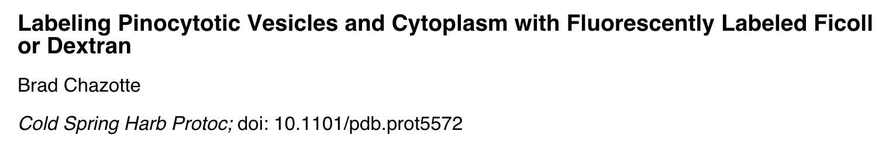

# Dye-conjugated Dextrans

This protocol has not been tested yet.

Link to the published protocol : [pdf](assets/chazotte2011.pdf)

Reference of the princeps paper :
K. Luby-Phelps, Methods Cell Biol. 29, 59 (1988)
Link to the article : [pdf](assets/luby-phelps1988.pdf)

Reference for the chemistry involved :
G. Hermanson, Bioconjugate Techniques, Second Edi (Academic Press, Inc., 2008).
Link to the pdf extract : [pdf](assets/aminoreactive.pdf)
## Materials

- Amino-dextran :
https://www.finabio.net/product/amino-dextrans/

- Fluorescent dyes : https://www.atto-tec.com

- Desalting columns :
  - PD-25 (GE, available pre-packed by SIgma Aldrich)
  - Zeba spin (Pierce Biotech, Thermo scientific)

##protocol
